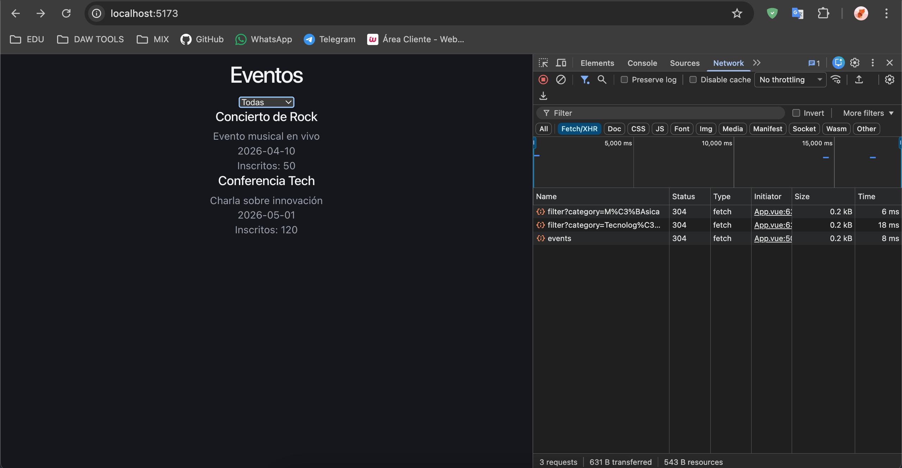
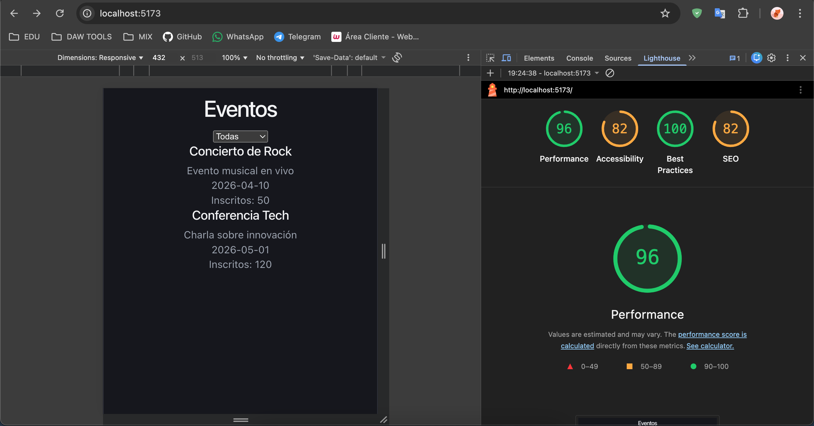
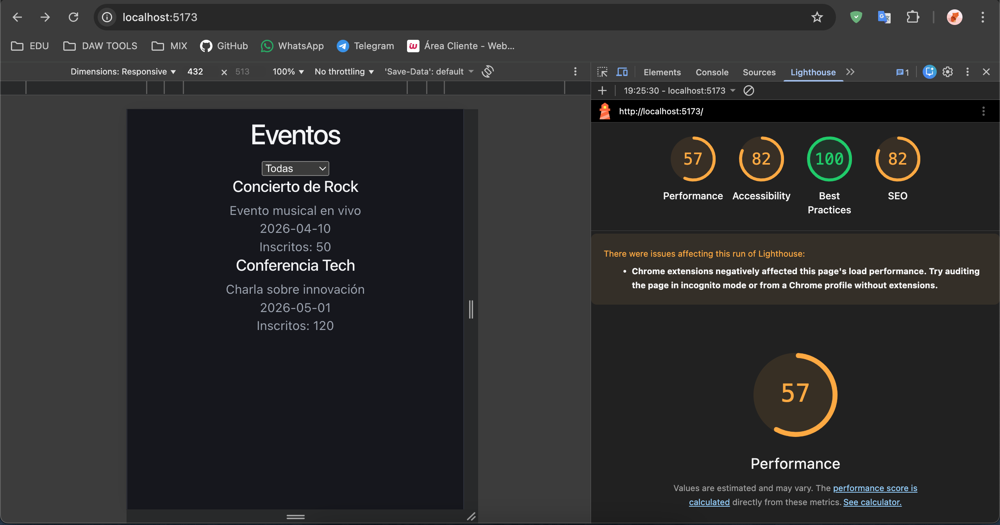

# Sistema de Gestión de Eventos Interactivo

[!NOTA] tener cuidado al probar el proyecto 

## Descripción

Aplicación web desarrollada con Vue.js y Node.js que permite gestionar y visualizar eventos de forma dinámica, incluyendo filtrado en tiempo real y actualización de inscritos.

## Tecnologías

* Frontend: Vue.js
* Backend: Node.js + Express
* Comunicación: REST API (AJAX)
* Estilos: CSS (responsive)

## Arquitectura

Se ha implementado una arquitectura basada en separación de responsabilidades:

* Frontend (Vista): Vue.js
* Backend (Controlador): Express
* Datos (Modelo): JSON

## Funcionalidades

* Listado dinámico de eventos
* Filtrado por categoría sin recarga
* Simulación de actualizaciones en tiempo real
* Interfaz responsive

## Instalación

### Backend

```bash
cd backend
npm install
node server.js
```

### Frontend

```bash
cd frontend
npm install
npm run dev
```

## Uso

Abrir en navegador:

```
http://localhost:5173
```

## Decisiones Técnicas

* Se eligió Vue por su simplicidad y curva de aprendizaje.
* Express por su ligereza y facilidad para crear APIs REST.
* JSON como base de datos simulada para rapidez de desarrollo.

## Mejoras Futuras

* Implementación real de WebSockets
* Base de datos (MongoDB)
* Autenticación de usuarios

## Imagenes del funcionamiento responsivo
* fetch - AJAX funcionando:
  
* Revisión responsive con lighthouse Desktop:
  
* Revisión responsive con lighthouse Movil:
  
